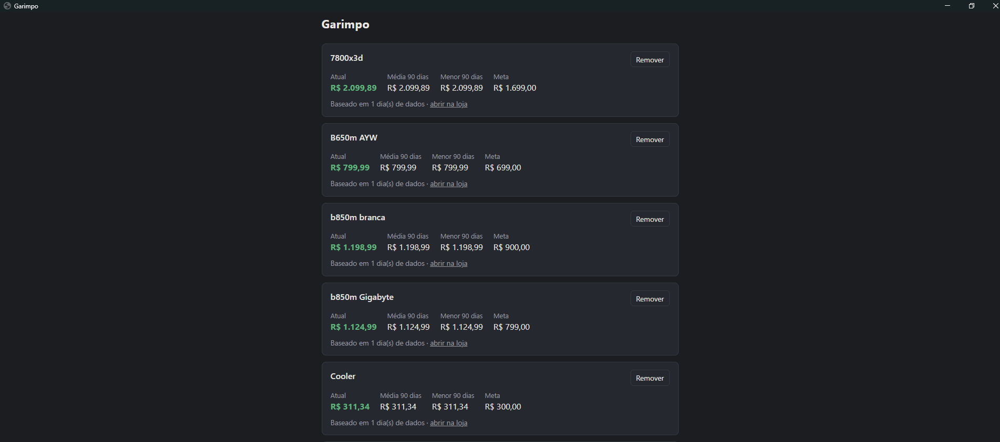

# Garimpo

Monitor de preços local. Você cadastra produtos de lojas online com um preço-alvo, o app coleta o preço todo dia e avisa quando ele atinge a meta.



## Como funciona

- Coleta agendada com Jsoup, lendo o preço em diferentes formatos de página (JSON do Next.js, JSON-LD e meta tags) e tratando formatos de valor monetário (`R$ 1.299,90`, `1299.90`, `1,299.90`).
- Histórico em H2/JPA com um registro por produto por dia (guarda o menor preço do dia), calculando preço médio e menor preço dos últimos 90 dias.
- Notificação do sistema ao atingir o preço-alvo, sem repetir o aviso enquanto o preço continua na meta. Se o preço sobe de novo, o aviso é rearmado.
- Só usa lojas que permitem leitura automatizada, com intervalo de 3 segundos entre as requisições.

## Estrutura

- `PriceReader`: lê o preço de uma página. Tenta o JSON do Next.js, depois o JSON-LD e por último as meta tags.
- `PriceJob`: a cada 6 horas lê cada produto, atualiza o histórico e decide se avisa.
- `PriceStats`: média, menor preço e quantidade de dias dos últimos 90 dias.
- `ProductController`: API REST para listar, adicionar e remover produtos.
- `Notifier`: notificação do sistema.

## Stack

Java, Spring Boot, Jsoup, JPA/Hibernate, H2, Maven. Testes com JUnit 5 e Mockito.

## Requisitos

JDK 21 ou superior e Maven (ou a IDE com Maven embutido, como o IntelliJ).

## Como rodar

```bash
mvn spring-boot:run
```

Depois é só abrir `http://localhost:8080`. Também dá pra abrir o projeto no IntelliJ e rodar a classe `GarimpoApplication`.

No meu uso pessoal, o backend sobe junto com o Windows e um atalho na área de trabalho abre a interface em janela própria.

## Testes

```bash
mvn test
```

Ou, no IntelliJ, botão direito em `src/test/java` e **Run 'All Tests'**.

- `PriceReaderTest`: formatos de valor, JSON do Next.js, JSON-LD, meta tags, ordem de prioridade entre as fontes e página sem preço.
- `PriceJobTest`: aviso ao atingir a meta, sem repetir, rearme quando o preço sobe, menor preço do dia e falha na leitura sem quebrar o job.
- `PriceStatsTest`: média e menor preço.

## Limitações

- Depende do HTML de cada loja: se a loja mudar a página, a coleta daquela loja pode parar de funcionar.
- Média e menor preço só ficam úteis depois de alguns dias de coleta (a tela mostra "baseado em N dia(s) de dados").
- Projeto de uso pessoal, feito para rodar local.